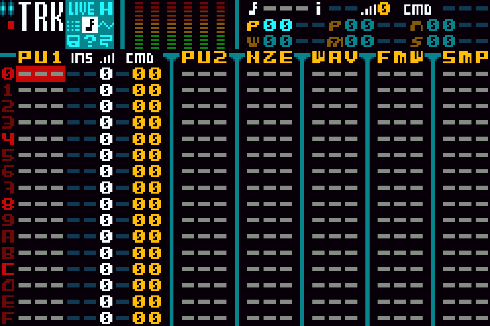

# M4GTracker


## Project Description
This repository holds the source code for both M4GTracker website and the DAW ROM.

M4GTracker is a minimalistic DAW (Digital Audio Workstation) designed specifically for the Game Boy Advance (GBA) handheld console.

It allows music creation using the console's internal sound chip, making it a portable toolkit to perform and compose within the chiptune and retro music production scenes.

### Key Features
  - Native Platform \
    It runs as an executable ROM for the Game Boy Advance.\
    It can be used on real hardware via flash cartridge or through emulator.
  
  - Optimized Interface \
    The project features a stylized and intuitive graphical interface tailored for the GBA screen, created in collaboration with the well-known pixel artist iLKke.
  
  - Development \
    It was originally created by indie developer Smiker during the late 2000s and early 2010s
  
  - Community Culture \
    It is nowadays a cult tool among vintage hardware enthusiasts who enjoy composing music within the strict technical limitations of 8-bit and 16-bit sound systems. 


Live Demo: https://m4gtracker.ddns.net



## Install / Deploy Instructions
You can deploy a copy of the website, or compile the code to get the latest version.

 1. Clone Repository
    ```bash
    git clone git@github.com:pinakure/M4GTracker.git /src/m4gtracker
    ```
 2. Get up the containers
    ```bash
    cd /src/m4gtracker
    docker compose up --build -d
    ```
## Web Operation
 1. Create Administrative User
    ```bash
    docker exec -it python manage.py createsuperuser
    ```
 2. Access to the Backoffice
    You can manage the website content navigating to ```http://<desired-domain>/admin/```    

## Compiling the ROM
 1. Launch compile script
    ```bash
    docker exec -it ./compile.sh
    ```
    The resulting ROM will be located at /src/m4gtracker/out/m4gtrack.gba